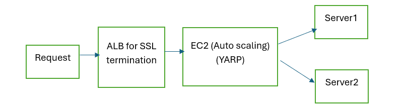
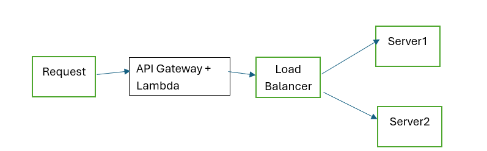

Overview
This guide compares two architectural approaches for implementing dynamic request routing based on customer ID without modifying client applications. We'll examine YARP-based and Lambda-based solutions from a high-level business perspective, focusing on capabilities, considerations, and recommendations.
Business Requirements
•	Dynamic Routing: Route requests to different backends based on customer ID in the payload
•	Traffic Volume: Handle 1,000 requests per second
•	Payload Size: Support large payloads (10MB to 100MB)
•	Client Compatibility: No modifications to client applications
•	Environment: AWS cloud infrastructure
Solution 1: YARP Reverse Proxy Approach
What is YARP?
YARP (Yet Another Reverse Proxy) is Microsoft's high-performance .NET-based reverse proxy that can inspect and route traffic based on request content.
Architecture Overview

How It Works
1.	Request Reception: All client requests arrive at a single Application Load Balancer
2.	Proxy Layer Processing: YARP-powered EC2 instances examine the request payload
3.	Customer ID Extraction: The proxy extracts the customer ID from the payload
4.	Dynamic Routing: Based on the customer ID, the request is forwarded to the appropriate backend
5.	Large Payload Handling: For very large payloads, temporary S3 storage may be used
Key Benefits
•	Superior Performance: Lower latency (5-15ms for small payloads)
•	Cost-Effective at Scale: Better economics for sustained high traffic
•	Efficient Large Payload Handling: Optimized for 10-100MB payloads
•	No Throttling Concerns: Scales horizontally without service limits
•	Deep Customization: Flexible middleware for complex routing logic
Considerations
•	Infrastructure Management: Requires EC2 instance management
•	Scaling Delay: Auto-scaling takes minutes rather than seconds
•	Operational Overhead: More infrastructure to monitor and maintain
•	Initial Setup Complexity: More complex initial deployment
Cost Profile
•	Infrastructure-Based Pricing: Pay for provisioned capacity
•	Lower Per-Request Cost: More economical at high volumes
•	Predictable Costs: Less variation based on traffic patterns
•	Estimated Monthly Cost: $650-$1,500 depending on scale
Solution 2: Lambda Serverless Approach
What is AWS Lambda?
AWS Lambda is a serverless compute service that runs code in response to events, automatically scaling from a few requests per day to thousands per second.
Architecture Overview

How It Works
1.	Request Reception: All client requests arrive at API Gateway
2.	Router Lambda Processing: A Lambda function examines the request payload
3.	Customer ID Extraction: The function extracts the customer ID from the payload
4.	Dynamic Routing: Based on the customer ID, requests are routed to the appropriate backend
5.	Large Payload Handling: For payloads exceeding Lambda limits, S3 storage and SQS queuing are used
Key Benefits
•	Serverless Management: No infrastructure to provision or manage
•	Rapid Elasticity: Instant scaling to match demand
•	Operational Simplicity: Fewer components to monitor and maintain
•	Pay-Per-Use: No charges when not processing requests
•	Easy Deployment: Simpler CI/CD integration
Considerations
•	Higher Latency: Added overhead (100-200ms for small payloads)
•	Concurrency Limits: Potential throttling at high volumes
•	Cold Start Impact: Performance variability on initial scaling
•	Higher Per-Request Cost: Less economical at sustained high volumes
•	Payload Size Limitations: More complex handling for very large payloads
Cost Profile
•	Consumption-Based Pricing: Pay only for what you use
•	Higher Per-Request Cost: More expensive per transaction
•	Variable Costs: Fluctuates with traffic patterns
•	Estimated Monthly Cost: $1,800-$2,500 depending on scale

